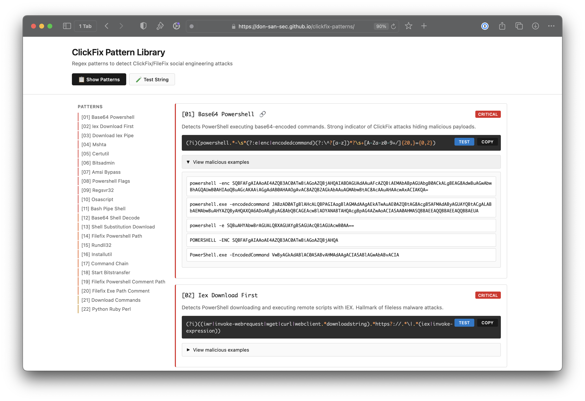

# ClickFix Pattern Library

Regex patterns for detecting ClickFix social engineering attacks.



## What is ClickFix?

ClickFix is a social engineering technique that tricks users into copying and executing malicious commands. Attackers disguise PowerShell, bash, or other scripts as "fixes" for fake errors. This library provides detection patterns to identify these attacks.

## Quick Links

- **[Live Documentation](https://don-san-sec.github.io/clickfix-patterns/)** - Interactive pattern browser with testing tool
- **[GitHub Repository](https://github.com/don-san-sec/clickfix-patterns)** - Source code and patterns

## Quick Start

```bash
make setup      # Install dependencies
make test       # Run pattern tests
make docs       # Generate documentation
```

## Pattern Structure

```
patterns/
├── critical-01-base64-powershell.yaml
├── critical-02-hidden-powershell.yaml
├── high-01-encoded-commands.yaml
├── high-02-iex-download.yaml
└── medium-01-suspicious-patterns.yaml
```

Each YAML pattern contains:
- **name** - Pattern identifier
- **severity** - Risk level (critical/high/medium)
- **description** - Detection intent
- **pattern** - Regex pattern(s)
- **malicious** - Test cases that should match
- **benign** - Test cases that should not match

## Interactive Tester

The [live documentation](https://don-san-sec.github.io/clickfix-patterns/) includes an interactive pattern tester:

1. Click **🧪 Test String** in the header
2. Paste any command or string
3. See which patterns match instantly
4. Click pattern names to view details

Perfect for validating patterns against real-world commands and identifying false positives.

## Development

```bash
# Test specific pattern
./scripts/run_tests.py critical-01-base64-powershell

# Test all patterns
./scripts/run_tests.py

# Generate documentation
./scripts/generate_docs.py
```

## Pattern Tiers

- **Critical** - Immediate threat indicators (encoded PowerShell, hidden execution)
- **High** - Strong malicious signals (remote downloads, script execution)
- **Medium** - Suspicious patterns requiring context

## License

MIT License - See [LICENSE](LICENSE) for details.
